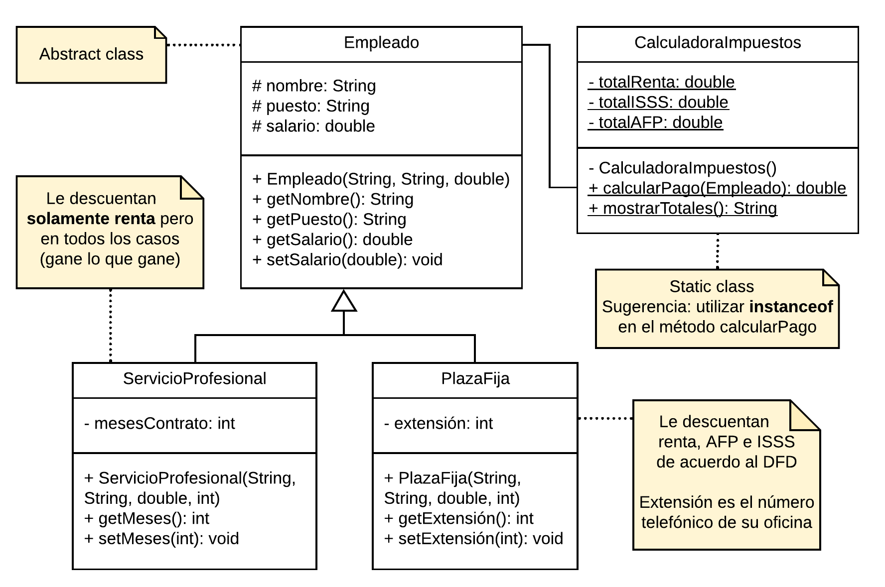
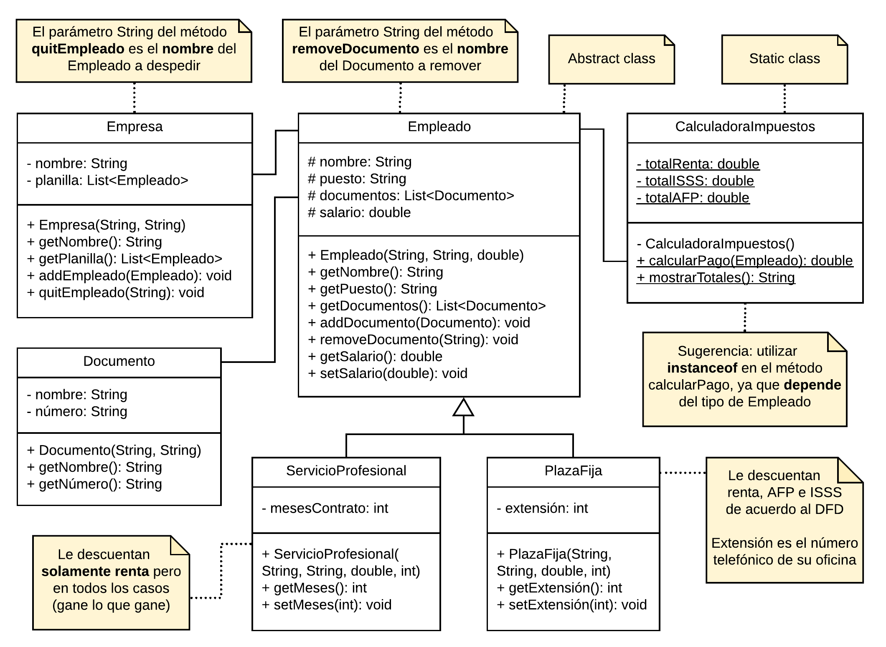
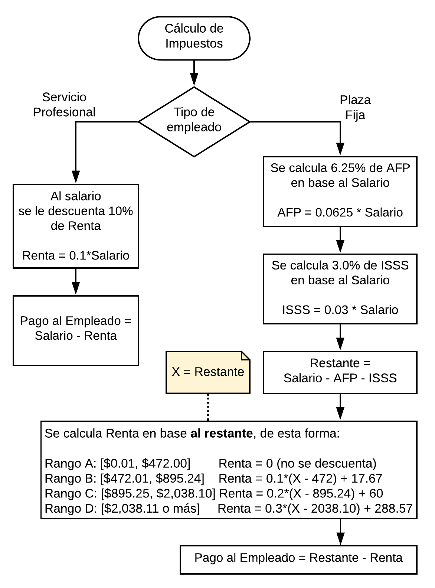

# Solucionario POO
Soluciones de ejercicios de portafolio, laboratorio y demás.

---
## Novedades
* Añadida descripción del parcial 01 [acá](#parciales).
* Añadida sesión extraordinaria de Google Meet, miércoles 1 de abril.
* Añadida 
<a href="https://github.com/Walter26/SolucionarioPOO/tree/master/Ejercicios%20guiados/Sesiones%20Google%20Meet/Martes%2014-04">sesión de Google Meet</a>
martes 14 de abril. Ejercicio sobre excepciones. 

* Añadida 
<a href="https://github.com/Walter26/SolucionarioPOO/tree/master/Ejercicios%20guiados/Sesiones%20Google%20Meet/Martes%2014-04">sesión de Google Meet</a>
jueves 16 de abril. Ejercicio sobre excepciones. 
<a href="https://github.com/Walter26/SolucionarioPOO/tree/master/Ejercicios%20guiados/Sesiones%20Google%20Meet/Jueves%2016-04">Meet</a>

---
## Utilidades
Si alguien tiene alguna consulta de algun ejercicio ya resuelto, en la pestaña de "Issues" puede crear un tema nuevo consultado específicamente. Cabe destacar que los ejercicios subidos son **propuestas** de solución, no es que específicamente deban ser resueltos así los ejercicios.

---
## Portafolio

### Semana 01
* Ejercicio 01. 
  Creación de clase Laptop y clase libre.
  
### Semana 02
* Ejercicio 01. 
  UML y ejercicio de libros y autores
  
* Ejercicio 02. 
  Modificación de ejercicio de libros y autores

---
## Laboratorios

### Laboratorio 02
Ejercicio de HerramientrasMinecraft.

### Laboratorio 03
Ejercicio de parquímetro.

### Laboratorio 04
Ejercicio de inventario.

---
## Parciales

### Parcial 01
A continuación se presentan dos diagramas de clase (UML), son diferentes para las personas que van en parejas, y las que no. Dependiendo de su situación tomará dicho UML para trabajar.

#### Aspectos comunes
* La fecha de entrega es el día <strong>domingo 19 de abril, a las 23:55</strong>.
* El programa deberá manejar cualquier tipo de error, es decir, <b>que no debe cerrarse ante situaciones inesperadas, no debe finalizar abruptamente</b>.

#### Enunciado individual

Se solicita, que a partir del siguiente diagrama UML, realice lo siguiente:

* En el Main, cree dos objetos, uno de tipo ServicioProfesional y otro de tipo PlazaFija.
* Para ambos objetos, calcule el pago respectivo y muestre los totales.

**Nota: en la clase estática, los atributos de los totales son acumuladores de los descuentos que se le realizan a cada empleado. Y calcular sueldo se refiere al sueldo liquido, es decir, salario base - descuentos. Descuentos segun tabla en la seccion de abajo.**

---

#### Enunciado parejas

Se solicita, que a partir del siguiente diagrama UML, realice lo siguiente:

<ul>
<li>Cree un objeto de tipo Empresa.</li>
<li>Mediante un menú, implemente las siguientes opciones</li>
  <ul>
    <li>Agregar empleado</li>
    <li>Despedir empleado</li>
    <li>Ver lista de empleados</li>
    <li>Calcular sueldo</li>
    <li>Mostrar totales</li>
  </ul>
</ul>

**Nota: en la clase estática, los atributos de los totales son acumuladores de los descuentos que se le realizan a cada empleado. Y calcular sueldo se refiere al sueldo liquido, es decir, salario base - descuentos. Descuentos segun tabla en la seccion de abajo.**

---

#### Diagrama de descuentos

---